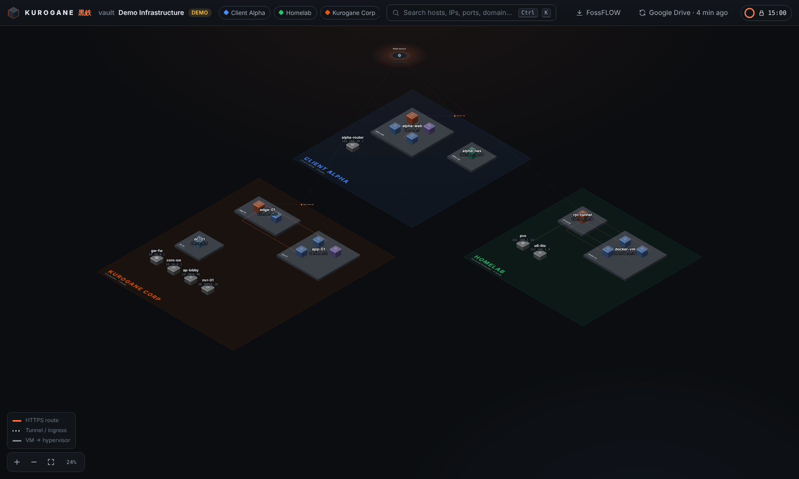
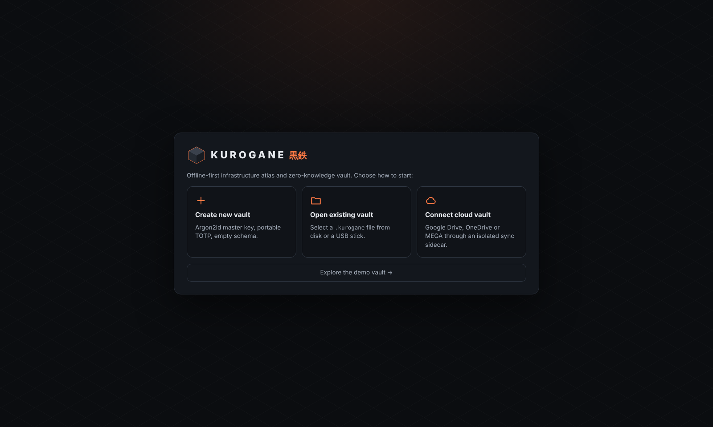
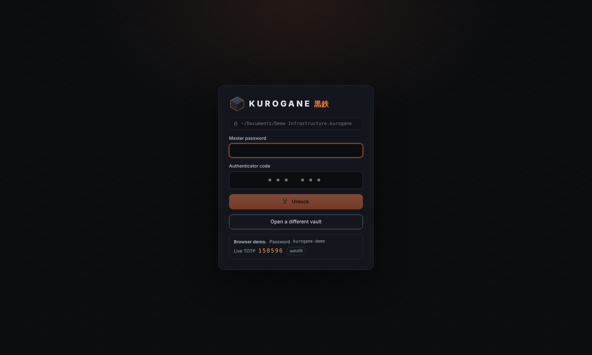
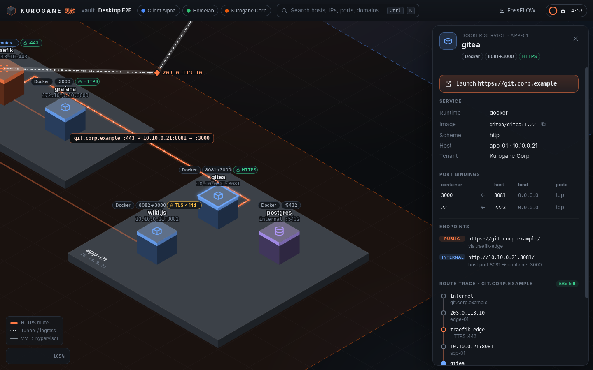
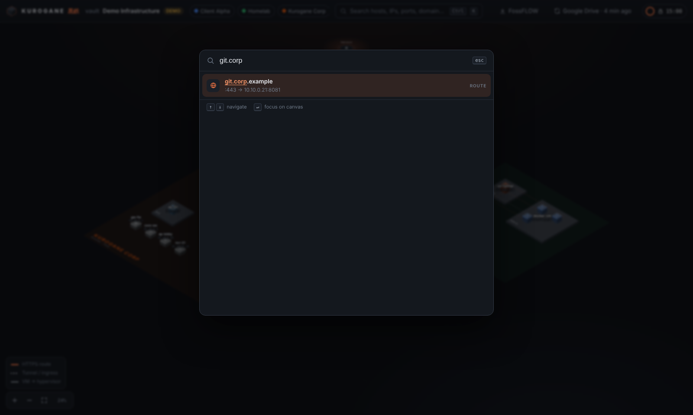

# KUROGANE 黒鉄

**Offline-first infrastructure atlas + zero-knowledge credential vault + isolated, zero-setup cloud sync.** It runs on macOS, Windows and Linux.

Kurogane reads your hybrid infrastructure (tenants, hosts, NICs, reverse proxies, routes, containers and credentials) from an encrypted vault and **draws it automatically** as an isometric map. It traces every public route, `Internet → public IP → proxy :443 → private IP:port → container`, and gives you 1-click SSH, RDP and browser launch, plus a secure credential drawer.



## Status

A working prototype scaffold with production-grade foundations. Everything listed under *Built & verified* runs and is covered by tests (43 Rust, 10 TypeScript). The *Roadmap* section is what remains before a 1.0.

### Built & verified

| Area | What exists | How it was verified |
|---|---|---|
| Key derivation | Argon2id (256 MiB / t=3 / p=4 default, 1 GiB hardened) → MEK → wrapped random VDK → HKDF subkeys | RFC 9106 test vector; tamper/downgrade tests |
| `.kurogane` container | 256-byte authenticated header + AES-256-GCM archive with SHA-256 manifest; atomic save with `.bak` | byte-exact round-trip; every header region tamper-tested |
| Database | SQLCipher 4 (vendored OpenSSL), schema v1 with cascades, triggers, partial indexes, a trace view; secrets additionally field-sealed | wrong key fails closed; raw file has no SQLite header; constraint tests |
| Portable TOTP | RFC 6238 seed sealed *inside* the vault; replay protection | RFC 6238 vectors (SHA1/256/512); vault moved between two work dirs unlocks with the same authenticator |
| Session lock | mlocked/`MADV_DONTDUMP` key pages; inactivity timeout; suspend detection; lock on exit; clipboard cleared on lock | unit tests with an injected clock; manual lock in the UI |
| Launchers | SSH in the native terminal (ssh-agent key loading), `.rdp` generation (never contains passwords), http(s)-only web launch | argument-injection tests (`-oProxyCommand`, CRLF in `.rdp`, `javascript:`) |
| Sync engine | rclone 1.75.1 pinned by SHA-256 (binary) or image digest (container); cleared-env sandbox; Drive limited to `drive.file`; lineage-based push/pull/conflict | real download + verification, real two-device sync through the sandboxed binary, OAuth scope checked against the live consent redirect |
| Canvas | Auto-layout from DB records (Isoflow/FossFLOW projection), orthogonal A* routes, LOD labels, badges, FossFLOW JSON export | layout invariants, determinism, export integrity; screenshots below |
| Desktop shell | Tauri v2, 19 IPC commands, strict CSP, no JS plugin permissions | built and driven under Xvfb: lock screen → unlock → canvas → omnibox → drawer |
| Headless mode | `kurogane` CLI: create, inspect, unlock, link (Drive/OneDrive/MEGA), sync | used for the end-to-end runs above |

### Roadmap (not done yet)

* **Editing UI.** Records are created through the core API, the CLI's `--demo` seed, or SQL. The canvas is read-only. Next come CRUD forms in the drawer, plus importers for `docker ps`/Compose, Traefik/NPM configs and the Cloudflare API.
* **Native screen-lock hooks** (logind `Lock`, `com.apple.screenIsLocked`, `WTS_SESSION_LOCK`) feeding `SessionClock::force_lock`. Suspend detection already works on Linux and macOS through clock divergence.
* **Clipboard history exclusion** (Windows `ExcludeClipboardContentFromMonitorProcessing`, macOS `org.nspasteboard.ConcealedType`).
* **Row-level 3-way merge** for sync conflicts. Today a conflict keeps both files and never loses data. UUID keys, `updated_at` triggers and tombstones are already in the schema for this.
* **Not exercised yet:** real Google, Microsoft and MEGA accounts, the Docker/Podman sidecar against a live daemon (its argv is unit-tested), and builds on macOS and Windows. The CI workflow targets all three OSes but has not run yet.
* An optional hardware-bound factor (FIDO2 `hmac-secret`) mixed into the KDF. See the TOTP threat-model note in [docs/CRYPTO.md](docs/CRYPTO.md#4-portable-offline-totp).

## Documentation

| Deliverable | Document |
|---|---|
| Architecture & framework justification | [docs/ARCHITECTURE.md](docs/ARCHITECTURE.md) |
| Cryptographic & container blueprint (byte layout, Argon2id, TOTP) | [docs/CRYPTO.md](docs/CRYPTO.md) |
| Isolated sync engine | [docs/SYNC.md](docs/SYNC.md) |
| Relational schema (DDL, ER diagram, cascades) | [docs/SCHEMA.md](docs/SCHEMA.md) · [`schema_v1.sql`](crates/kurogane-core/src/db/schema_v1.sql) |
| Isometric canvas adapter | [docs/CANVAS.md](docs/CANVAS.md) |

## Repository layout

```
Kurogane/
├── Cargo.toml                    workspace (core/sync/cli are default members; no WebKit needed to test)
├── crates/
│   ├── kurogane-core/            security kernel — no UI dependencies
│   │   └── src/
│   │       ├── kdf.rs            Argon2id profiles + hostile-parameter bounds
│   │       ├── keys.rs           VDK → HKDF key ring (payload, sqlcipher, field, totp, sync)
│   │       ├── container.rs      .kurogane header + KGPK archive + manifest
│   │       ├── crypto.rs         AES-256-GCM, sealed fields
│   │       ├── secure.rs         page-locked, zeroize-on-drop SecretBox
│   │       ├── totp.rs           RFC 6238 + otpauth URI + QR SVG
│   │       ├── session.rs        inactivity + suspend detection
│   │       ├── launch.rs         SSH / RDP / web launchers with allow-list validation
│   │       ├── fsutil.rs         atomic write + .bak, shred
│   │       ├── vault.rs          create / unlock / save / reload / change password
│   │       └── db/               SQLCipher DAL, schema_v1.sql, models, demo seed
│   ├── kurogane-sync/            rclone provisioning, sandbox, runners, OAuth, reconcile, engine
│   └── kurogane-cli/             `kurogane` headless manager
├── src-tauri/                    desktop shell: commands.rs, state.rs, clipboard.rs, tauri.conf.json
├── ui/                           React + TypeScript (Vite)
│   └── src/
│       ├── canvas/               iso.ts, layout.ts, pathfinder.ts, IsoCanvas.tsx, fossflowExport.ts
│       ├── components/           Drawer, Omnibox, LockScreen, Wizard, TopBar
│       ├── search/               fuzzy matcher + omnibox index
│       ├── api/                  Backend interface, Tauri bindings, DTO types
│       └── mock/                 browser demo backend + fixture generated by the CLI
└── docs/
```

## Quick start

Prerequisites: Rust ≥ 1.80, Node ≥ 20, Perl and `make` (to build the vendored OpenSSL behind SQLCipher). On Linux, also install the [Tauri prerequisites](https://v2.tauri.app/start/prerequisites/) (`libwebkit2gtk-4.1-dev` etc.).

```bash
# Core tests (no GUI toolchain needed)
cargo test

# UI tests + browser demo (mock backend; demo password and live TOTP are shown on the lock screen)
cd ui && npm install && npm test && npm run dev        # http://127.0.0.1:1420

# Desktop app
cd ui && npm run build && cd .. && cargo run -p kurogane-app --features custom-protocol
# or, with hot reload:   cd ui && npx tauri dev --config ../src-tauri/tauri.conf.json

# Headless
cargo run -p kurogane-cli -- create ~/infra.kurogane --demo      # prints the TOTP QR
cargo run -p kurogane-cli -- inspect ~/infra.kurogane            # clear-text header, no password
cargo run -p kurogane-cli -- engine provision                    # download + verify rclone
cargo run -p kurogane-cli -- link ~/infra.kurogane drive         # browser consent, no API keys
cargo run -p kurogane-cli -- sync ~/infra.kurogane
```

Regenerate the UI fixture after changing the seed: `cargo run -p kurogane-cli -- demo-fixture --out ui/src/mock/demo-fixture.json`.

## Screens

| | |
|---|---|
|  First run: create, open or connect a cloud vault |  Unlock: Argon2id + portable TOTP |
|  Route trace + secure drawer with an auto-clearing clipboard |  ⌘/Ctrl+K omnibox: IPs, ports, domains, tenants |

## Security summary

* Zero-knowledge and offline: nothing leaves the machine unless you link a cloud remote, and what leaves is the encrypted container.
* Defence in depth: container AEAD ⊃ SQLCipher pages ⊃ field-sealed secrets. Every layer has its own HKDF-separated key.
* The webview never sees keys. It sees secrets only on an explicit, audited Reveal. Copy and launch keep plaintext on the Rust side.
* Read the honest limits (TOTP's role, revealed secrets in the JS heap, SSD remanence) in [docs/CRYPTO.md](docs/CRYPTO.md).

## Third-party

See [THIRD_PARTY_NOTICES.md](THIRD_PARTY_NOTICES.md). The canvas projection and connector-routing model are adapted from Isoflow / FossFLOW (MIT).
