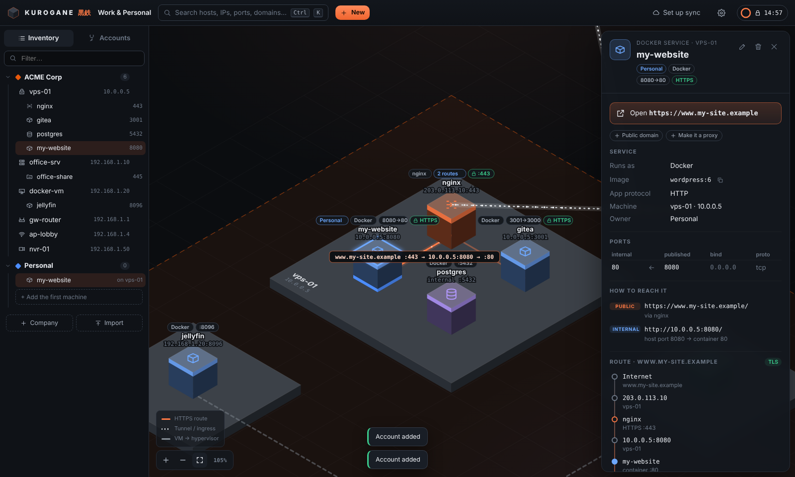
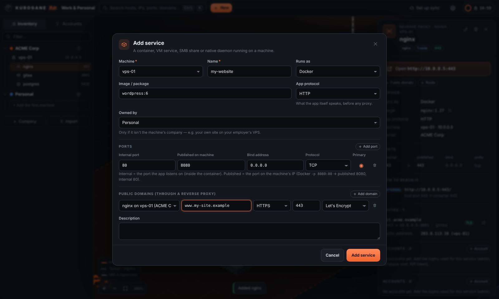
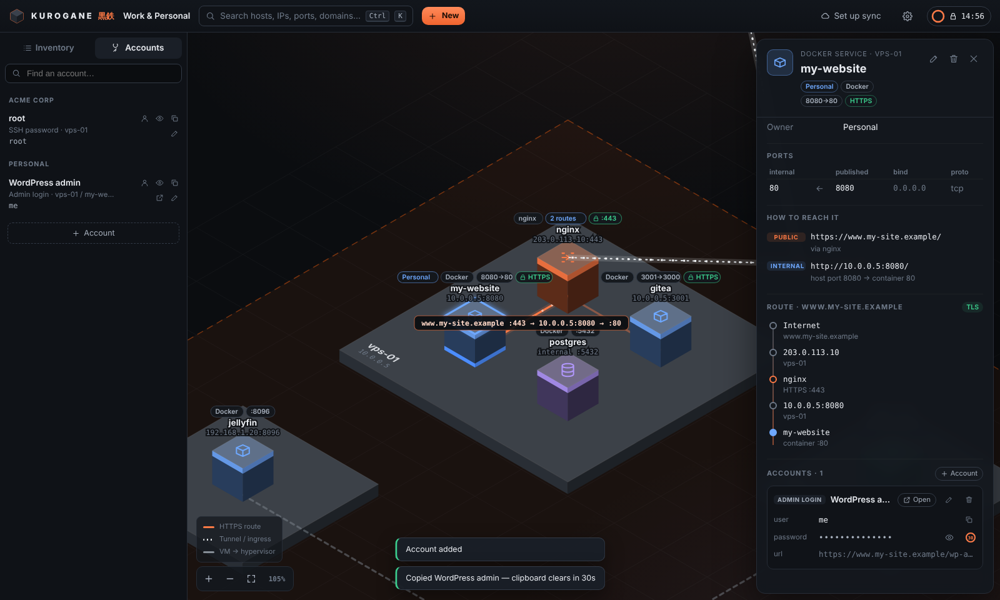
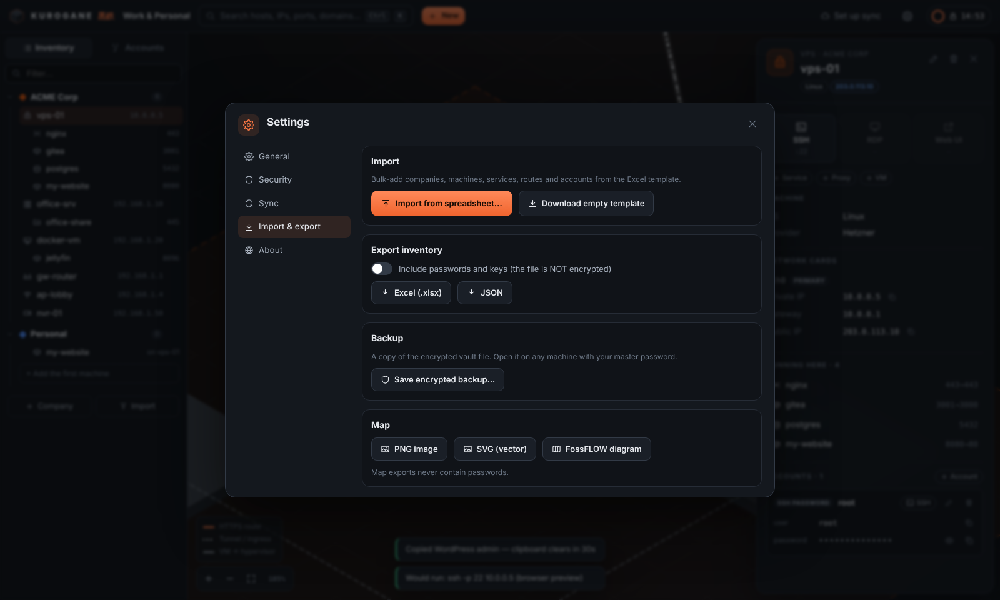
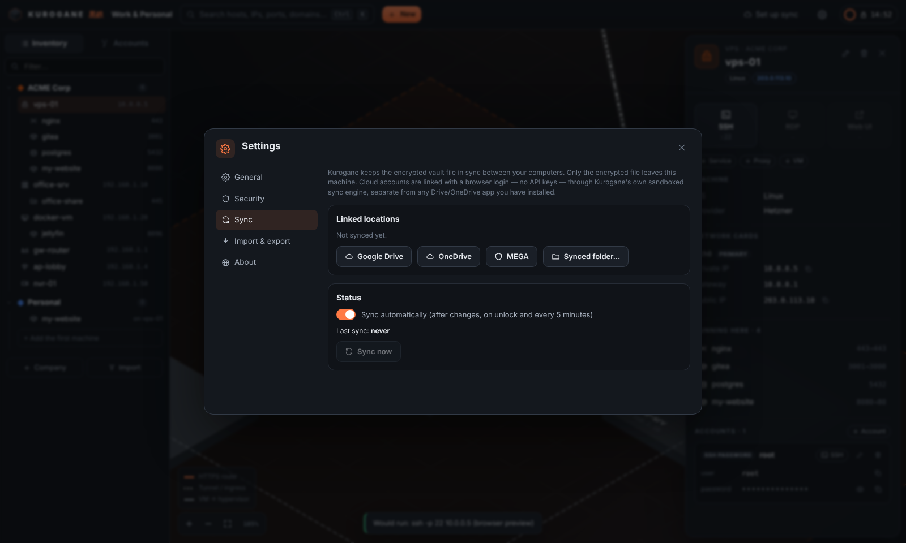

# KUROGANE 黒鉄

**A map of every machine, service and password you look after, drawn for you.**

You enter companies, machines, services, reverse proxies and accounts in simple forms. Kurogane draws them as an isometric diagram grouped by company, traces each public domain through the proxy to the container behind it, and keeps every password in an encrypted vault. Click **Open** to launch a site, **SSH** to get a terminal, or **RDP** to start a remote desktop session.

A product of [Issen Software Group](https://issen.kurokamicorp.com).

Runs offline on Windows, macOS and Linux. The vault is a single encrypted file that you can sync through Google Drive, OneDrive, MEGA or any folder you already sync.



## What it answers at a glance

For every service: **which company owns it** (even when it runs on another company's server), the machine it runs on, **internal port vs published port**, the **private and public IPs** and the network card they belong to, whether it is **HTTP or HTTPS**, which **domain** points at it through which **reverse proxy**, and the **accounts** for it.

For every machine (VPS, server, VM, router, access point, NVR, NAS, switch, firewall…): its network cards and IPs, the VMs and containers on it, and its SSH, RDP and other logins.

Search everything with **Ctrl/⌘ + K**: names, IPs, ports, domains, usernames.

## Install

Download the installer for your system from the [Releases](../../releases) page.

| System | File | Notes |
|---|---|---|
| Windows 10/11 | `Kurogane_<version>_x64-setup.exe` | Installs for your user only, so no admin rights are needed. Until the installer is code-signed, SmartScreen asks first: choose *More info → Run anyway*. |
| macOS 13+ (Apple silicon and Intel) | `Kurogane_<version>_universal.dmg` | Open it and drag **Kurogane** onto **Applications**. The app is ad-hoc signed but not notarized. On first launch, right-click → *Open*, or run `xattr -dr com.apple.quarantine /Applications/Kurogane.app`. |
| Linux (x86-64) | `Kurogane_<version>_amd64.AppImage` | `chmod +x` it and run it. Everything it needs is bundled. Works on Ubuntu 22.04, Debian 12, Fedora 36 or newer. |

Double-clicking a `.kurogane` file opens it in Kurogane.

## Using it

1. **Create a vault.** Pick a master password. Two-factor (any authenticator app) is optional and can be turned on later under *Settings → Security*.
2. **Add a company**, then its **machines**. Each machine has a list of network cards, each with a private IP and an optional public IP. VMs can point at the machine they run on.
3. **Add services** on a machine. A service can be a Docker container, a VM service, an SMB share or a native daemon. Give it its internal port and the port it is published on. If it belongs to a different company than the machine (for example your own website on your employer's VPS), set *Owned by*.
4. **Add the reverse proxy** (nginx, Traefik, Caddy, Nginx Proxy Manager, Cloudflare Tunnel…) and its routes: `www.example.com` → service. You can also do this from the service form under *Public domains*.
5. **Add accounts** to a company, machine, service or proxy. Passwords, SSH keys, tokens and secure notes are encrypted inside the vault.

| | |
|---|---|
|  Ports, owner company and public domains in one form |  Every account, grouped by company. Copying a password clears the clipboard after 30 s |

Click anything on the map or in the sidebar to open its drawer. From there you can open its website, connect by SSH or RDP, copy or reveal a password, edit it, or delete it. Before anything is deleted, Kurogane tells you what else goes with it.

### Import and export

*Settings → Import & export* lets you **download an empty Excel template**. It has one sheet per kind of record, drop-down lists for every choice and a *Read me* sheet. Fill it in and import it. Kurogane checks every row first and shows what will be created or updated, and what is wrong (sheet and row). Nothing changes until you confirm.

You can also export the whole inventory to Excel or JSON, with or without passwords, save an encrypted backup of the vault, and export the map as PNG, SVG or a FossFLOW diagram. Map exports never contain passwords.



### Sync between computers

*Settings → Sync* links **Google Drive, OneDrive or MEGA** with a browser login (no API keys, nothing to register), or a **synced folder** (Dropbox, iCloud Drive, Syncthing, a NAS share…). Only the encrypted vault file leaves the machine. Sync runs automatically after changes, on unlock, every 5 minutes, and before locking or quitting. If two computers changed the vault at the same time, you choose which version to keep, and the other one is kept as a backup.

On another computer: install Kurogane, choose *Get it from the cloud* on the first screen, and unlock with the same password. Your authenticator keeps working.



### Security

* **Zero-knowledge and offline.** No account, no server, no telemetry. Only the encrypted file is synced.
* **Layered encryption.** Argon2id (256 MiB) derives the key for an AES-256-GCM container. Inside it, SQLCipher encrypts the database pages, and every password, key and note is sealed again on its own. Each layer has its own key.
* **Passwords stay in the Rust core.** The interface only sees a password when you click *Reveal*, and only for 15 seconds. *Copy*, *SSH* and *RDP* never pass it through the webview. RDP files never contain passwords.
* **Auto-lock** after inactivity (configurable) and when the computer sleeps. Keys are held in locked memory and wiped on lock.
* Honest limits, such as what two-factor does and doesn't protect against offline: [docs/CRYPTO.md](docs/CRYPTO.md).

## Building from source

Prerequisites: Rust ≥ 1.85, Node ≥ 22.12, Perl and `make` for the vendored OpenSSL behind SQLCipher (plus NASM on Windows). On Linux, also the [Tauri prerequisites](https://v2.tauri.app/start/prerequisites/) (`libwebkit2gtk-4.1-dev` …).

```bash
cd ui && npm ci && cd ..

# Run the desktop app with hot reload
node ui/node_modules/@tauri-apps/cli/tauri.js dev

# Build the installer for this OS (output in target/release/bundle/)
node ui/node_modules/@tauri-apps/cli/tauri.js build --bundles appimage   # Linux
node ui/node_modules/@tauri-apps/cli/tauri.js build --bundles nsis       # Windows
node ui/node_modules/@tauri-apps/cli/tauri.js build --target universal-apple-darwin --bundles app,dmg   # macOS

# Tests
cargo test                      # Rust core, sync engine, CLI
cd ui && npm test               # UI
```

`cd ui && npm run dev` serves the interface in a browser at http://127.0.0.1:1420 against an in-memory backend, which is handy for UI work. That backend exists only in development builds.

[`.github/workflows/release.yml`](.github/workflows/release.yml) builds Windows, universal macOS and Linux installers as GitHub Actions artifacts. It has no release-creation step. Source changes or a manual dispatch start a build.

Appearance defaults to Light. Settings → General offers Light, Dark and System, saved on this computer. The material language follows Boundless and EION Studios. The [macOS SwiftUI shell](docs/MACOS.md) adds native Liquid Glass navigation on macOS 26+, retaining the shared map and editors. macOS source builds require Xcode 26+.

### Headless CLI

`kurogane` manages vaults without the GUI. It is useful on servers and for scripting.

```bash
kurogane create ~/infra.kurogane                     # new empty vault
kurogane totp ~/infra.kurogane                       # optional two-factor
kurogane inspect ~/infra.kurogane                    # clear-text header, no password needed
kurogane unlock ~/infra.kurogane                     # print a summary
kurogane link ~/infra.kurogane drive                 # or onedrive / mega
kurogane link-folder ~/infra.kurogane ~/Dropbox      # sync through a folder
kurogane sync ~/infra.kurogane
```

## Documentation

| Topic | Document |
|---|---|
| Architecture and why Tauri + Rust | [docs/ARCHITECTURE.md](docs/ARCHITECTURE.md) |
| Encryption, file format, two-factor | [docs/CRYPTO.md](docs/CRYPTO.md) |
| Sync engine | [docs/SYNC.md](docs/SYNC.md) |
| Database schema | [docs/SCHEMA.md](docs/SCHEMA.md) |
| How the map is drawn | [docs/CANVAS.md](docs/CANVAS.md) |

## Repository layout

```
crates/kurogane-core/    encryption, vault file, SQLCipher database, editing, Excel/JSON import-export, launchers
crates/kurogane-sync/    pinned rclone, sandbox, folder sync, lineage and conflict handling
crates/kurogane-cli/     `kurogane` headless tool
src-tauri/               desktop shell: commands, sync scheduler, import/export, installer config
ui/src/                  React interface
  canvas/                isometric layout, routing, map export
  components/            sidebar, drawer, settings, lock screen, first-run wizard, dialogs
  forms/                 company, network, machine, service, proxy, account forms
```

## Roadmap

* Code-signed Windows installer and a notarized macOS build.
* Row-level merge for sync conflicts. Today you pick one version and nothing is lost. The schema already has the UUIDs, timestamps and tombstones a merge needs.
* Native screen-lock hooks, and hiding copied passwords from clipboard-history tools.
* An optional hardware key (FIDO2) mixed into the key derivation.

## Third-party

See [THIRD_PARTY_NOTICES.md](THIRD_PARTY_NOTICES.md). The map projection and connector routing are adapted from Isoflow / FossFLOW (MIT).
