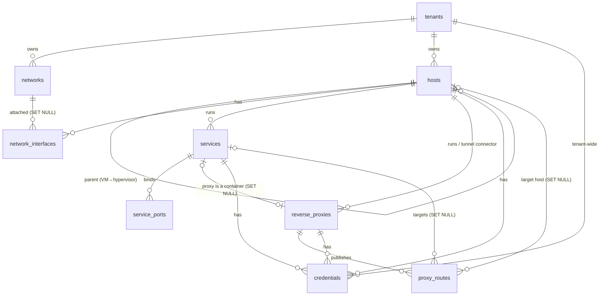

# Relational schema

The complete DDL is in [`crates/kurogane-core/src/db/schema_v1.sql`](../crates/kurogane-core/src/db/schema_v1.sql). It is applied by the migration runner in `db/mod.rs`, tracked with `PRAGMA user_version`, and refuses to open a vault whose schema is newer than the build.

## Tables

| Table | Purpose | Notable constraints |
|---|---|---|
| `vault_meta` | Singleton: name, lock timeout, clipboard TTL, lock-on-suspend | `CHECK (id = 1)`, timeout 60–86400 s |
| `vault_security` | Sealed TOTP seed + config + replay counter | `CHECK (totp_enabled = 0 OR totp_secret_sealed IS NOT NULL)` |
| `tenants` | Company / environment root | unique `name COLLATE NOCASE`; `environment` enum (corporate, client, personal, lab, staging, production); hex colour check |
| `networks` | Subnets per tenant | `UNIQUE(tenant_id, cidr)`, VLAN 1–4094 |
| `hosts` | VPS, servers, VMs, switches, APs, routers, firewalls, NVRs, NAS, edge devices | `UNIQUE(tenant_id, name)`, category enum, port ranges, no self-parent |
| `network_interfaces` | NIC name, internal IP, gateway, public egress IP | `UNIQUE(host_id, name)`; **partial unique index**: one primary NIC per host |
| `services` | Containers, systemd units, SMB shares, Windows services… | runtime enum, scheme enum, `UNIQUE(host_id, name)` |
| `service_ports` | Internal binding port vs host port | `UNIQUE(service_id, container_port, protocol)`; **triggers** forbid two services on one host publishing the same host port/protocol on overlapping bind addresses |
| `reverse_proxies` | Nginx, Traefik, NPM, Caddy, HAProxy, Cloudflare Tunnel | runs on a host, optionally *is* a service |
| `proxy_routes` | domain → inbound port/protocol (+TLS expiry) → target IP:port → service | `UNIQUE(proxy_id, domain, path_prefix, inbound_port)`; `CHECK (inbound_protocol <> 'https' OR tls_mode <> 'none')` |
| `credentials` | SSH key/password, RDP, WinRM, web GUI, admin, DB user, API token, SMB, SNMP | **exactly one owner**: `CHECK ((tenant_id IS NOT NULL) + (host_id IS NOT NULL) + (service_id IS NOT NULL) + (proxy_id IS NOT NULL) = 1)`; secrets only in `*_sealed` BLOBs; `ssh_key` requires a private key |
| `sync_remotes` | Cloud links (sealed rclone section) | `UNIQUE(provider, remote_path)` |
| `audit_log` | reveal / copy / launch / sync events | indexed by time |
| `tombstones` | deletions, for future 3-way merge | filled by `AFTER DELETE` triggers, including cascaded deletes |

## Cascading rules

* **Ownership cascades down**: deleting a tenant removes its networks, hosts, interfaces, services, ports, proxies, routes and credentials (tested).
* **Cross-links are `SET NULL`**: deleting a container never deletes the proxy route that pointed at it. The route stays visible as dangling, which is exactly what an operator needs to see. The same applies to `route.target_host_id`, `proxy.service_id`, `nic.network_id` and `host.parent_host_id`.

## Indexes

Every foreign key has an index, partial where the column is nullable (`WHERE x IS NOT NULL`). Lookups the omnibox and canvas need are indexed: `internal_ip`, `public_ip`, `host_port`, `domain`, `tls_expires_at` (expiry dashboards), `credentials.expires_at`.

## Conventions

* UUIDv4 `TEXT` primary keys: stable across devices and merge-friendly. The demo seed uses UUIDv5 for reproducible fixtures.
* ISO-8601 UTC `TEXT` timestamps. `updated_at` is maintained by `AFTER UPDATE` triggers; `recursive_triggers` is off, so there is no loop.
* Enumerations are `TEXT + CHECK`, so the file stays self-describing for anyone inspecting it with SQLCipher tools.
* View `v_route_traces` flattens Internet → edge public IP → proxy → target IP:port → service → container port for the canvas and the "Launch" action.

## Data-access layer

`db/repo.rs` holds typed insert/load functions. All sealing and unsealing happens there and nowhere else. `load_topology()` returns the secret-free `Topology` DTO, and `credential_secret()` decrypts one field on demand. `db/seed.rs` is the mock-data loader: three tenants, 14 hosts, 15 services, 3 proxies, 8 routes, 22 credentials.
